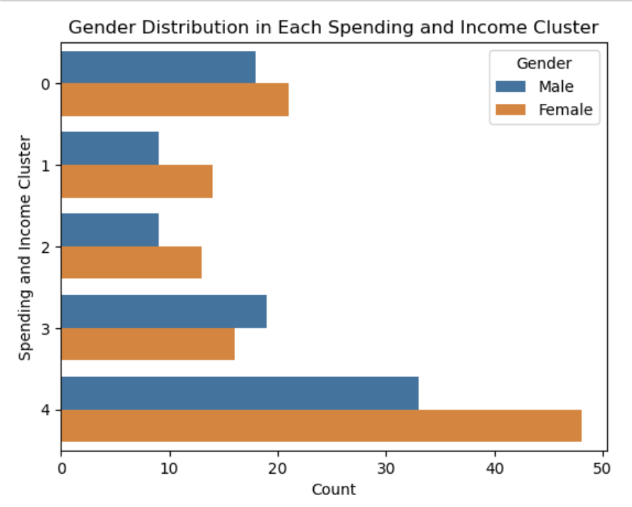

# Customer-Segmentation-Clustering

## Introduction

In today's data-driven world, understanding customers' diverse needs and preferences is paramount for businesses seeking a competitive edge. Customer segmentation and clustering offer powerful techniques to unravel complex patterns and uncover invaluable insights hidden within vast amounts of customer data. As a data enthusiast and machine learning practitioner, I embarked on a captivating portfolio project to explore the realm of customer segmentation using the popular K-means algorithm in Python. In this project, I delved into the fascinating world of data analysis, uncovering distinct customer groups and enabling businesses to personalize their strategies, optimize marketing efforts, and enhance customer experiences.

## Exploratory Data Analysis and Data Visualization

### Overview of Dataset

The first step is to get an overview of the dataset. Here are the first five rows of the dataset

Then summarizing the dataset, including its size, column names, and any missing values.

From this information, we can gather the following:

- The dataset does not contain any missing values (all columns have 200 non-null values).
- The 'customerID' column is a unique identifier for each customer and is stored as integers.
    

    
- The 'Gender' column represents the gender identity of the customers, and it contains categorical data.
- The 'Age' column represents the age of the customers, and it is stored as integers.
- The 'Annual Income (k$)’ column represents the annual income for each customer, also stored as integers.
- The 'Spending Score' column represents points given to each customer based on how much is spent and is stored as integers.

### Basic Statistics

I calculated basic statistics to gain an understanding of the dataset's overall characteristics.

After reading and loading the dataset, we computed basic statistics for the numeric columns: 'Annual Income (k$)’ and 'Spending Score'. These basic statistics give us a preliminary understanding of the dataset's characteristics and serve as a starting point for further exploration and analysis.

### Distribution of Numeric Variables

I examine the distributions of numeric variables, such as 'Age', 'Annual Income (k$)’, and 'Spending Score'. By visualizing these distributions, we can determine their shapes, and ranges, and identify any outliers.

From these histograms, we can conclude we have a normal distribution i.e variable has a relatively narrow range and moderate variability (most observations clustered around the mean). 

### Clustering

**Univariate**

Started the cluster analysis using one variable(**Univariate)**, the 'Annual Income (k$)’ i.e. what’s the appropriate number of clusters can we segment the customer using the Annual Income of the customer? 

I used Kmeans elbow method to determine the number of clusters appropriate for the segmentation of the customer 

We can see from the elbow that 3 is the appropriate cluster we can segment our customers into.

Cluster 0 Annual income  is within 80-60k$

Cluster 1 Annual Income is within 10 - 50k$

Cluster 2 Annual income is within 90 - 140k$

****Bivariate Clustering****

I used two variables Annual Income (k$) and 
Spending Score (1-100) to get the appropriate cluster to segment the customers 

I used Kmeans elbow method to determine the number of clusters appropriate for the segmentation of the customer

We can see from the elbow that 5 is where we had a good elbow and 5 is the appropriate cluster we can segment our customers based on their Annual Income (k$) and Spending Score (1-100)

The scatter plot shows the five clusters

Cluster 0  has a low Spending Score and low annual income

Cluster 1  has a Mid Spending Score and Mid annual income

Cluster 2  has a high Spending Score and high annual income

Cluster 3 has a low spending Score but High annual income

Cluster 4  has a high Spending Score but a low annual income

 I further analyzed each cluster by Gender and age  

Recommendation 

Target Cluster

- The target group would be cluster 2 which has a high Spending Score and high income
- 54 percent of cluster 2 shoppers are women. We should look for ways to attract these customers using a marketing campaign targeting popular items in this cluster
- Cluster 4 presents an interesting opportunity to market to the customers for sales event on popular items
